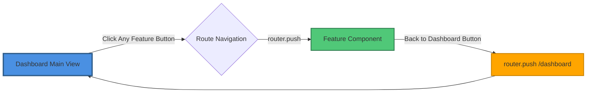
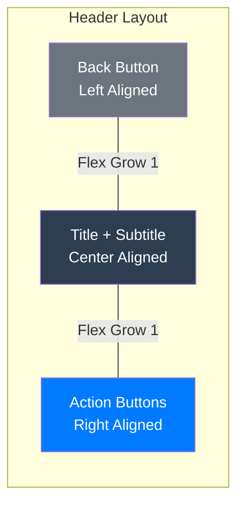
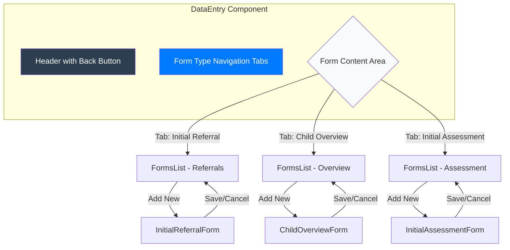
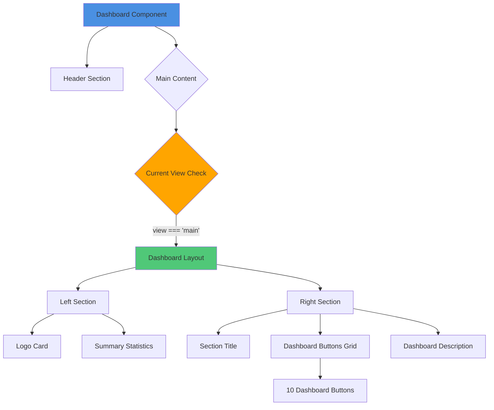
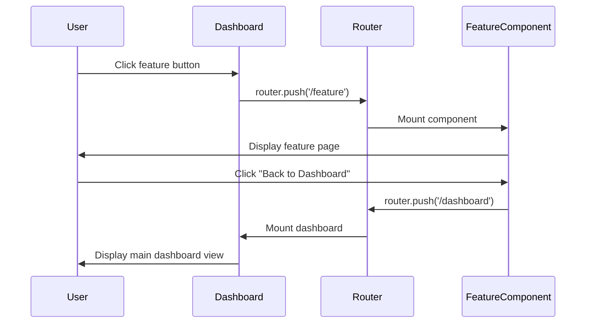

# Back to Dashboard Button Fix and Layout Improvement

## Overview

This design addresses inconsistent navigation behavior in the Kukhoma Project Data Management System where the "Back to Dashboard" button functionality varies across different dashboard modules. The primary issue is that certain dashboard buttons navigate to separate route components (Capture, TrackerCapture, EventReports, UserManagement) while others use in-component view switching within Dashboard.vue. This creates a UX inconsistency where the back navigation behaves differently depending on which module is accessed.

### Problem Statement

**Navigation Inconsistency**: The dashboard employs two distinct navigation patterns:
- **Router-based Navigation**: Buttons like "Tracker Capture", "Capture", "Events", and "Users" navigate to dedicated route components using `router.push()`
- **View-switching Navigation**: Buttons like "Child Tracker", "Analytics", "Analysis", "Reports", and "Data Entry" use internal view state management via `setCurrentView()`

This dual approach causes confusion because:
- Router-based modules have standalone "Back to Dashboard" buttons that use `router.push('/dashboard')`
- View-switching modules have "Back to Dashboard" buttons that use `setCurrentView('main')`
- The router-based approach may not preserve dashboard state and requires full component reload
- Users experience different back navigation behavior depending on which feature they access

### Business Impact

- **User Experience**: Inconsistent navigation creates cognitive load and confusion
- **Workflow Efficiency**: Users may lose context when navigating between features
- **Training Overhead**: Staff need to understand two different navigation patterns
- **Maintenance Complexity**: Developers must maintain two separate navigation systems

## Architecture Analysis

### Current Navigation Architecture

```mermaid
graph TB
    subgraph Dashboard Component
        Main[Main Dashboard View]
        DataEntry[Data Entry View]
        ChildTracker[Child Tracker View]
        Visualization[Visualization View]
        Analysis[Analysis View]
        Reports[Reports View]
        EventReportsInternal[Event Reports View Internal]
        ManageUsers[Manage Users View]
    end
    
    subgraph Separate Route Components
        Capture[Capture Component]
        TrackerCapture[TrackerCapture Component]
        EventReports[EventReports Component]
        UserManagement[UserManagement Component]
    end
    
    Main -->|setCurrentView| DataEntry
    Main -->|setCurrentView| ChildTracker
    Main -->|setCurrentView| Visualization
    Main -->|setCurrentView| Analysis
    Main -->|setCurrentView| Reports
    Main -->|setCurrentView| EventReportsInternal
    Main -->|setCurrentView| ManageUsers
    
    Main -->|router.push /capture| Capture
    Main -->|router.push /tracker-capture| TrackerCapture
    Main -->|router.push /event-reports| EventReports
    Main -->|router.push /user-management| UserManagement
    
    Capture -->|router.push /dashboard| Main
    TrackerCapture -->|router.push /dashboard| Main
    EventReports -->|router.push /dashboard| Main
    UserManagement -->|router.push /dashboard| Main
    
    DataEntry -->|setCurrentView main| Main
    ChildTracker -->|setCurrentView main| Main
    Visualization -->|setCurrentView main| Main
    Analysis -->|setCurrentView main| Main
    Reports -->|setCurrentView main| Main
    EventReportsInternal -->|setCurrentView main| Main
    ManageUsers -->|setCurrentView main| Main
    
    style Main fill:#4A90E2
    style Capture fill:#E24A4A
    style TrackerCapture fill:#E24A4A
    style EventReports fill:#E24A4A
    style UserManagement fill:#E24A4A
```



### Component Structure Analysis

| Dashboard Button | Current Implementation | Navigation Method | Back Button Behavior |
|-----------------|------------------------|-------------------|---------------------|
| Tracker Capture | Separate Route Component | `router.push('/tracker-capture')` | `router.push('/dashboard')` |
| Reports | Dashboard Internal View | `setCurrentView('reports')` | `setCurrentView('main')` |
| Data Entry | Dashboard Internal View | `setCurrentView('data-entry')` | `setCurrentView('main')` |
| Child Tracker | Dashboard Internal View | `setCurrentView('child-tracker')` | `setCurrentView('main')` |
| Analytics | Dashboard Internal View | `setCurrentView('visualization')` | `setCurrentView('main')` |
| Events | Separate Route Component | `router.push('/event-reports')` | `router.push('/dashboard')` |
| Capture | Separate Route Component | `router.push('/capture')` | `router.push('/dashboard')` |
| Residents | Dashboard Internal View | `setCurrentView('child-tracker-2')` | `setCurrentView('main')` |
| Analysis | Dashboard Internal View | `setCurrentView('data-analysis')` | `setCurrentView('main')` |
| Users | Separate Route Component | `router.push('/user-management')` | `router.push('/dashboard')` |

### Root Cause Identification

The architectural inconsistency stems from evolutionary development where:
1. Initial features were built as internal dashboard views for rapid prototyping
2. Complex features (Capture, TrackerCapture, EventReports, UserManagement) were later separated into standalone route components for better code organization
3. No refactoring was done to standardize the navigation pattern
4. Both patterns coexist creating technical debt

## Proposed Solution

### Strategic Approach: Unified Route-Based Navigation

**Decision**: Standardize all major dashboard features as separate route components with consistent router-based navigation.

**Rationale**:
- **Separation of Concerns**: Each feature becomes an independent, testable component
- **Code Maintainability**: Easier to locate and modify feature-specific code
- **Performance**: Vue Router provides built-in lazy loading and route-level code splitting
- **URL State**: Browser history and bookmarking work correctly
- **Developer Experience**: Clear routing structure visible in router configuration
- **Future Scalability**: Easy to add new features following established pattern

### Navigation Flow Design



### Component Migration Strategy

Components requiring migration from internal views to separate routes:

| Component Name | Current State | Target Route | Priority |
|---------------|---------------|--------------|----------|
| Child Tracker | Internal View | `/child-tracker` | High |
| Data Visualization (Analytics) | Internal View | `/analytics` | High |
| Data Analysis | Internal View | `/data-analysis` | Medium |
| Reports (Weekly) | Internal View | `/reports` | High |
| Data Entry Forms | Internal View | `/data-entry` | High |

Components already using route-based navigation (no change required):
- Tracker Capture (`/tracker-capture`)
- Capture (`/capture`)
- Event Reports (`/event-reports`)
- User Management (`/user-management`)

### Router Configuration Design

New route definitions to be added to `router/index.js`:

| Route Path | Component | Route Name | Auth Required | Description |
|-----------|-----------|------------|---------------|-------------|
| `/child-tracker` | ChildTracker.vue | ChildTracker | Yes | In-house children tracking module |
| `/analytics` | DataVisualization.vue | Analytics | Yes | Data visualization and charts |
| `/data-analysis` | DataAnalysis.vue | DataAnalysis | Yes | Advanced data analysis tools |
| `/reports` | Reports.vue | Reports | Yes | Weekly reports generation |
| `/data-entry` | DataEntry.vue | DataEntry | Yes | Form-based data entry |

### Dashboard Button Mapping

Updated Dashboard.vue button click handlers:

```mermaid
flowchart TD
    subgraph Dashboard Buttons Grid
        B1[Tracker Capture]
        B2[Reports]
        B3[Data Entry]
        B4[Child Tracker]
        B5[Analytics]
        B6[Events]
        B7[Capture]
        B8[Residents]
        B9[Analysis]
        B10[Users]
    end
    
    B1 -->|router.push| R1[/tracker-capture]
    B2 -->|router.push| R2[/reports]
    B3 -->|router.push| R3[/data-entry]
    B4 -->|router.push| R4[/child-tracker]
    B5 -->|router.push| R5[/analytics]
    B6 -->|router.push| R6[/event-reports]
    B7 -->|router.push| R7[/capture]
    B8 -->|router.push| R4
    B9 -->|router.push| R9[/data-analysis]
    B10 -->|router.push| R10[/user-management]
    
    style B1 fill:#E8F4F8
    style B2 fill:#FFF4E6
    style B3 fill:#F0F8E8
    style B4 fill:#FFE6F0
    style B5 fill:#F4E8FF
    style B6 fill:#E8F8F4
    style B7 fill:#FFE8E8
    style B8 fill:#FFE6F0
    style B9 fill:#E8F0FF
    style B10 fill:#FFF8E6
```

## Layout Improvements

### Header Standardization

All feature components should follow a consistent header layout pattern:

#### Standard Header Structure

| Section | Content | Alignment | Purpose |
|---------|---------|-----------|---------|
| Header Left | "Back to Dashboard" Button | Left | Primary navigation action |
| Header Center | Page Title + Subtitle | Center | Context and orientation |
| Header Right | Action Buttons + Logout | Right | Secondary actions |

#### Header Visual Specifications



**Header Styling Requirements**:
- Background: White (`#ffffff`)
- Border Bottom: 1px solid `#e9ecef`
- Padding: 1rem 2rem
- Display: Flex with space-between
- Box Shadow: `0 2px 4px rgba(0,0,0,0.1)`

### Back Button Design Specification

All "Back to Dashboard" buttons must follow this design:

**Visual Properties**:
- Background: Linear gradient `135deg, #6c757d 0%, #5a6268 100%`
- Text Color: White
- Border: 2px solid `rgba(255, 255, 255, 0.2)`
- Padding: 0.625rem 1.25rem
- Border Radius: 8px
- Font Size: 0.9rem
- Font Weight: 600
- Text Transform: Uppercase
- Letter Spacing: 0.3px
- Box Shadow: `0 2px 6px rgba(0, 0, 0, 0.15)`

**Icon Integration**:
- SVG arrow-left icon (16x16)
- Positioned before text with 0.5rem gap
- Stroke width: 2
- Stroke color: currentColor

**Hover State**:
- Background: Linear gradient `135deg, #5a6268 0%, #495057 100%`
- Transform: `translateY(-2px)`
- Box Shadow: `0 4px 12px rgba(0, 0, 0, 0.2)`
- Border Color: `rgba(255, 255, 255, 0.3)`
- Transition: `all 0.3s cubic-bezier(0.4, 0, 0.2, 1)`

### Responsive Design Considerations

**Mobile Layout (< 768px)**:
- Header converts to column layout
- Back button full width at top
- Title centered below
- Action buttons stacked below title
- Padding reduced to 0.75rem 1rem

**Tablet Layout (768px - 1024px)**:
- Maintain three-column flex layout
- Reduce padding to 0.875rem 1.5rem
- Font sizes scale down 10%

**Desktop Layout (> 1024px)**:
- Full specifications as outlined above
- Maximum width: 1400px centered

## Data Entry Component Refactoring

### Current Data Entry Architecture

The Data Entry feature currently manages multiple form types within Dashboard.vue:
- Initial Child Referral Forms
- Child Overview Forms  
- TKP Initial Assessment Forms

**Current View State Management**:

| View State | Display Component | Purpose |
|-----------|------------------|---------|
| `initial-referral-list` | FormsList | Display list of initial referral forms |
| `child-overview-list` | FormsList | Display list of child overview forms |
| `initial-assessment-list` | FormsList | Display list of initial assessment forms |
| `initial-referral-new` | InitialReferralForm | Create/edit initial referral form |
| `child-overview-new` | ChildOverviewForm | Create/edit child overview form |
| `initial-assessment-new` | InitialAssessmentForm | Create/edit initial assessment form |

### New Data Entry Component Design

Create a new standalone `DataEntry.vue` component that encapsulates all form management logic.

#### DataEntry Component Structure



#### Component Interface

**Props**: None (standalone component)

**Emitted Events**:
- `form-saved`: When any form is successfully saved
- `form-cancelled`: When form creation is cancelled

**Internal State**:

| State Variable | Type | Purpose |
|---------------|------|---------|
| `currentFormType` | String | Active form type tab (initial-referral, child-overview, initial-assessment) |
| `currentView` | String | View mode (list, new, edit) |
| `selectedForm` | Object | Form data when editing |
| `availableForms` | Array | Form type definitions |

**Methods**:

| Method Name | Parameters | Purpose |
|------------|-----------|---------|
| `setCurrentForm` | formId: String | Switch between form type tabs |
| `handleFormSaved` | formData: Object | Process successful form save |
| `handleFormEdit` | form: Object | Load form for editing |
| `handleAddNewForm` | formType: String | Switch to new form creation |
| `backToFormsList` | formType: String | Return to forms list view |
| `goBackToDashboard` | none | Navigate back to dashboard |

## Component-Level Changes

### Dashboard.vue Modifications

**Removal of Internal Views**:
- Remove all view-switching logic for features being migrated to routes
- Simplify `currentView` state to only handle `main` view
- Remove embedded components: ChildTracker, DataVisualization, DataAnalysis, Reports
- Remove form management logic (move to DataEntry.vue)

**Button Click Handlers Update**:

| Button | Old Handler | New Handler |
|--------|------------|-------------|
| Tracker Capture | `setCurrentView('tracker-capture')` → `router.push('/tracker-capture')` | Already correct |
| Reports | `setCurrentView('reports')` | `router.push('/reports')` |
| Data Entry | `setCurrentView('data-entry')` | `router.push('/data-entry')` |
| Child Tracker | `setCurrentView('child-tracker')` | `router.push('/child-tracker')` |
| Analytics | `setCurrentView('visualization')` | `router.push('/analytics')` |
| Events | `setCurrentView('event-reports')` | Already correct (router-based) |
| Capture | Already correct | No change |
| Residents | `setCurrentView('child-tracker-2')` | `router.push('/child-tracker')` |
| Analysis | `setCurrentView('data-analysis')` | `router.push('/data-analysis')` |
| Users | Already correct | No change |

**Simplified Dashboard Template Structure**:



### Capture.vue Verification

**Current Implementation**: ✓ Already follows standard pattern

**Header Structure**: ✓ Correct three-column layout

**Back Button**: 
- Current: `router.push('/dashboard')`
- Required: No change needed
- Includes unsaved changes warning: ✓

**Improvements Needed**:
- Ensure back button styling matches specification
- Verify responsive behavior on mobile devices

### TrackerCapture.vue Verification

**Current Implementation**: ✓ Already follows standard pattern

**Header Structure**: ✓ Correct three-column layout

**Back Button**:
- Current: `router.push('/dashboard')`
- Required: No change needed

**Improvements Needed**:
- Standardize back button styling to match specification
- Ensure consistent icon usage (currently correct)

### EventReports.vue Verification

**Current Implementation**: ✓ Already follows standard pattern

**Header Structure**: ✓ Correct three-column layout with nested navigation

**Back Button**:
- Current: `router.push('/dashboard')`
- Required: No change needed

**Improvements Needed**:
- Align back button styling with standard specification
- Verify mobile responsive behavior

### UserManagement.vue Verification

**Current Implementation**: ✓ Already follows standard pattern

**Header Structure**: ✓ Correct three-column layout

**Back Button**:
- Current: `router.push('/dashboard')`
- Required: No change needed

**Improvements Needed**:
- Update back button styling to match standard specification
- Ensure icon consistency

## Testing Strategy

### Unit Testing

**Dashboard Component Tests**:

| Test Case | Purpose | Expected Outcome |
|-----------|---------|------------------|
| Button Click - Tracker Capture | Verify navigation | `router.push('/tracker-capture')` called |
| Button Click - Reports | Verify navigation | `router.push('/reports')` called |
| Button Click - Data Entry | Verify navigation | `router.push('/data-entry')` called |
| Button Click - Child Tracker | Verify navigation | `router.push('/child-tracker')` called |
| Button Click - Analytics | Verify navigation | `router.push('/analytics')` called |
| Button Click - Analysis | Verify navigation | `router.push('/data-analysis')` called |
| Button Click - Users (with permission) | Verify navigation | `router.push('/user-management')` called |
| Button Click - Users (no permission) | Verify blocked | No navigation occurs |

**Feature Component Tests**:

| Component | Test Case | Expected Outcome |
|-----------|-----------|------------------|
| ChildTracker | Back button click | Navigates to `/dashboard` |
| DataVisualization | Back button click | Navigates to `/dashboard` |
| DataAnalysis | Back button click | Navigates to `/dashboard` |
| Reports | Back button click | Navigates to `/dashboard` |
| DataEntry | Back button click | Navigates to `/dashboard` |
| Capture | Back button with unsaved changes | Shows confirmation dialog |
| TrackerCapture | Back button click | Navigates to `/dashboard` |
| EventReports | Back button click | Navigates to `/dashboard` |
| UserManagement | Back button click | Navigates to `/dashboard` |

### Integration Testing

**Navigation Flow Tests**:



**Test Scenarios**:

1. **Full Navigation Cycle**
   - Start at dashboard
   - Navigate to each feature
   - Return to dashboard from each feature
   - Verify dashboard state preserved

2. **Direct URL Access**
   - Access feature URLs directly
   - Verify authentication guard
   - Navigate back to dashboard
   - Verify no errors

3. **Browser Back Button**
   - Navigate: Dashboard → Feature → Dashboard
   - Press browser back button
   - Verify behavior consistent with app navigation

4. **Multiple Feature Navigation**
   - Dashboard → Feature A → Dashboard → Feature B → Dashboard
   - Verify no state pollution between features

### User Acceptance Testing

**Test Checklist**:

- [ ] All dashboard buttons navigate to correct features
- [ ] All "Back to Dashboard" buttons return to main dashboard
- [ ] Navigation is consistent across all features
- [ ] No console errors during navigation
- [ ] Dashboard state (statistics, view) preserved on return
- [ ] Browser back/forward buttons work correctly
- [ ] Direct URL access to features works
- [ ] Authentication redirects work properly
- [ ] Mobile navigation works smoothly
- [ ] Header layout consistent across all pages
- [ ] Back button styling consistent across all pages

### Performance Testing

**Metrics to Monitor**:

| Metric | Target | Measurement Method |
|--------|--------|-------------------|
| Component Mount Time | < 500ms | Vue DevTools Performance tab |
| Navigation Response Time | < 200ms | Chrome DevTools Lighthouse |
| Route Transition Smoothness | 60fps | Browser Performance API |
| Memory Usage Per Component | < 50MB | Chrome DevTools Memory profiler |

## Migration Risks and Mitigation

### Risk Assessment

| Risk | Impact | Probability | Mitigation Strategy |
|------|--------|-------------|---------------------|
| Breaking existing workflows | High | Medium | Comprehensive testing before deployment |
| User confusion during transition | Medium | High | User training and documentation |
| Data loss during navigation | High | Low | Implement unsaved changes warnings |
| Performance degradation | Medium | Low | Code splitting and lazy loading |
| Route conflicts | Low | Low | Careful route naming and testing |

### Rollback Strategy

If critical issues are discovered post-deployment:

1. **Immediate Rollback**: Revert to previous dashboard structure (internal views)
2. **Partial Rollback**: Keep migrated components, revert problematic ones
3. **Feature Flag**: Implement toggle between old and new navigation patterns

### Migration Phases

**Phase 1: Infrastructure Setup**
- Create new route definitions
- Set up component files for migrated features
- Establish header component template

**Phase 2: Component Migration**
- Migrate Child Tracker component
- Migrate Reports component
- Migrate Data Entry component
- Update Dashboard button handlers

**Phase 3: Visual Standardization**
- Implement standardized header across all components
- Update back button styling
- Ensure responsive design consistency

**Phase 4: Testing and Refinement**
- Execute unit tests
- Perform integration testing
- Conduct user acceptance testing
- Address discovered issues

**Phase 5: Documentation and Training**
- Update user documentation
- Create training materials
- Brief support team

**Phase 6: Deployment**
- Deploy to staging environment
- Monitor for issues
- Deploy to production
- Monitor user feedback

## Success Metrics

### Key Performance Indicators

| KPI | Baseline | Target | Measurement |
|-----|----------|--------|-------------|
| Navigation Consistency Score | 50% (5/10 consistent) | 100% (10/10 consistent) | Manual audit of navigation patterns |
| User Task Completion Rate | Not measured | > 95% | User testing sessions |
| Navigation-related Support Tickets | Baseline TBD | Reduce by 80% | Support ticket tracking |
| Average Page Load Time | Baseline TBD | < 1 second | Performance monitoring |
| Code Maintainability Index | Current complexity | +20% improvement | SonarQube analysis |

### User Experience Metrics

- **Navigation Intuitiveness**: Measured through user testing (target: 4.5/5)
- **Feature Discovery**: Time to find and access features (target: < 10 seconds)
- **Error Rate**: Navigation errors per session (target: < 0.1)
- **User Satisfaction**: Post-implementation survey (target: > 85% satisfied)
